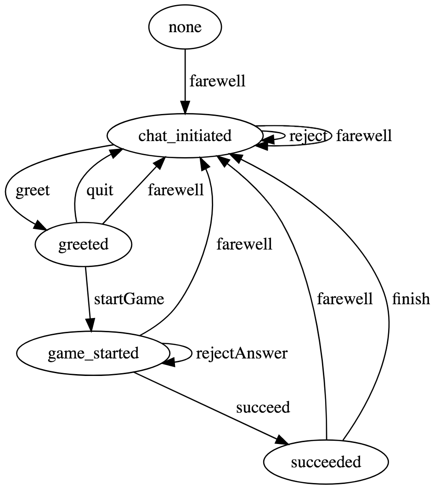

# Facebook chatbots: what do they do? do they do things? let's find out

Exploration around conversational interfaces and finate state machines, as part of a nice hackathon trip to Sweden.

# Prepare

Create a Facebook App and a Facebook Page, get the credentials, attach a webhook - e.g. with now, https://my-app.now.sh/messenger/webhook

Credentials (inject as environment variables):

* `VERIFY_TOKEN`: can be any string, need to be inserted here and in FB admin UI
* `PAGE_TOKEN`: get that from Messanger settings of your Facebook App admin UI
* `FB_APP_SECRET`: get that from your Facebook App admin UI

# Develop

When in development, you can e.g. use ngrok to use as the webhook URL, e.g. https://e0931885.ngrok.io/messenger/webhook. Then run like this:

```shell
VERIFY_TOKEN=<token> PAGE_TOKEN=<token> FB_APP_SECRET=<token> DEBUG=botmaster:* yarn nodemon app.js
```

# Chatbot description

Very simple indeed - waits to be greeted, invites to play a game, asks one question and waits for correct answer, then forgets you talked.

States diagram looks like this (generated using [`javascript-state-machine`'s visualisation feature](https://github.com/jakesgordon/javascript-state-machine/blob/master/docs/visualization.md) and [GraphvizOnline](https://dreampuf.github.io/GraphvizOnline/)):



For "smart" features uses:

* [Facebook's built-in NLP feature](https://developers.facebook.com/docs/messenger-platform/built-in-nlp) to detect user's greeting and saying bye
* [Speakeasy package](https://github.com/nhunzaker/speakeasy) for detecting positive/negative sentiment on the answer
* [`yes-no-words` package](https://github.com/sindresorhus/yes-no-words) to guess if user confirmed or rejected

---


